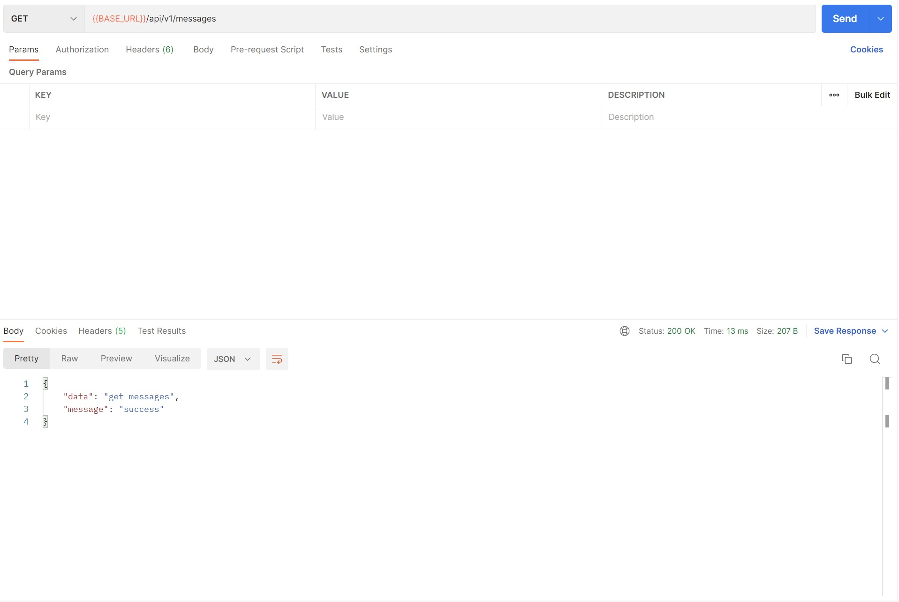
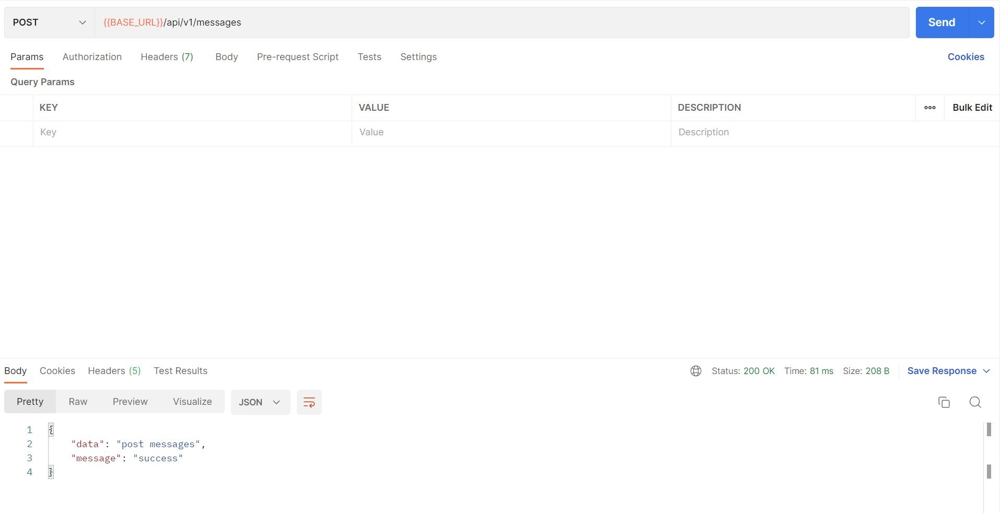
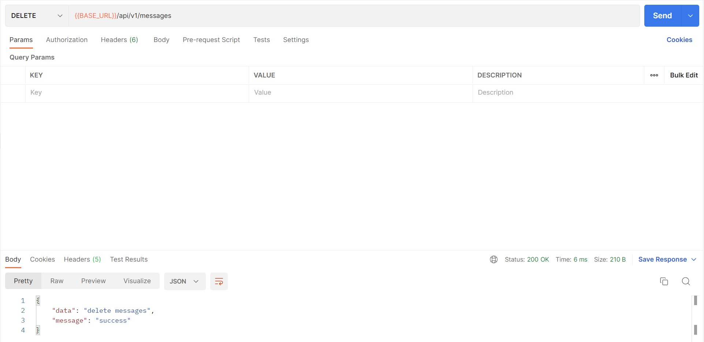

## Springboot introduction

#### GET `{{BASE_URL}}/api/v1/messages`

This end-point is basically for fetching message data stored in server

#### POST `{{BASE_URL}}/api/v1/messages`

This end-point is basically for adding or creating message data stored in server

#### DELETE `{{BASE_URL}}/api/v1/messages`

This end-point is basically for removing message data stored in server

