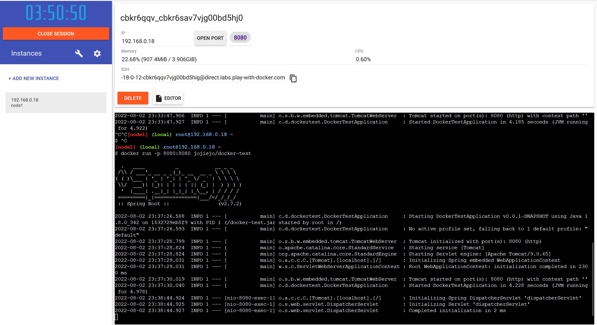
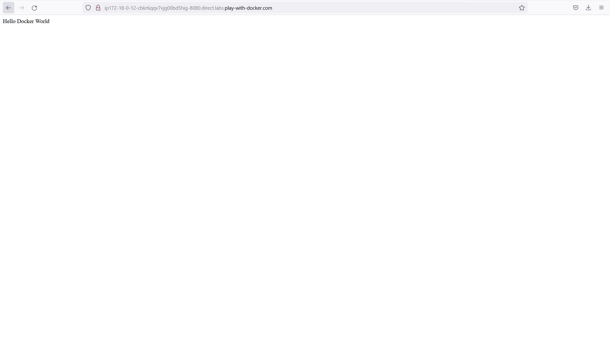

## Play with Docker

### Local container commands

```
docker logout
docker login
docker build -t jojiejo/docker-test .
docker run -d -p 8080:8080 jojiejo/docker-test
=> open localhost:8080
docker container ls
docker tag jojiejo/docker-test jojiejo/docker-test:1.0
docker push jojiejo/docker-test
docker run -d -p 8080:8080 jojiejo/docker-test
=> open localhost:8080
```

### Using Play with Docker

```
docker pull jojiejo/docker-test
docker run -d -p 8080:8080 jojiejo/docker-test
=> open the web-page with specified domain & port
```

### Play with Docker


### Play with Docker Result

